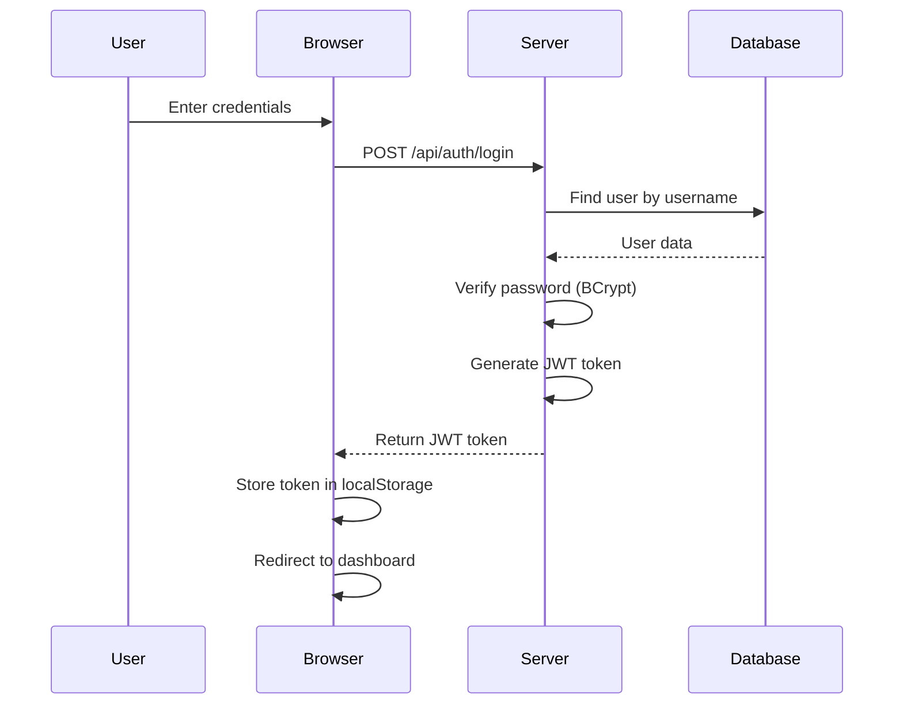
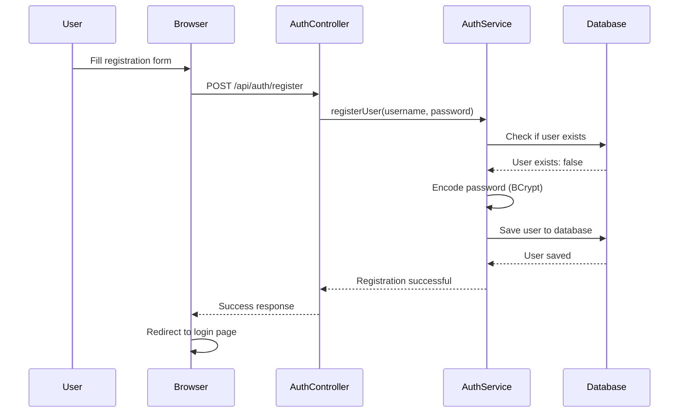
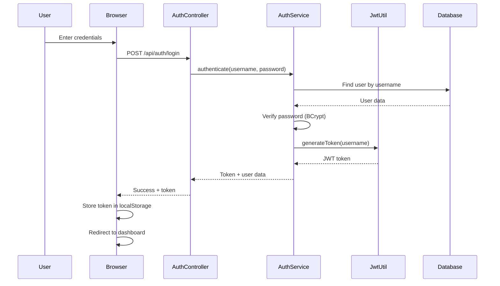
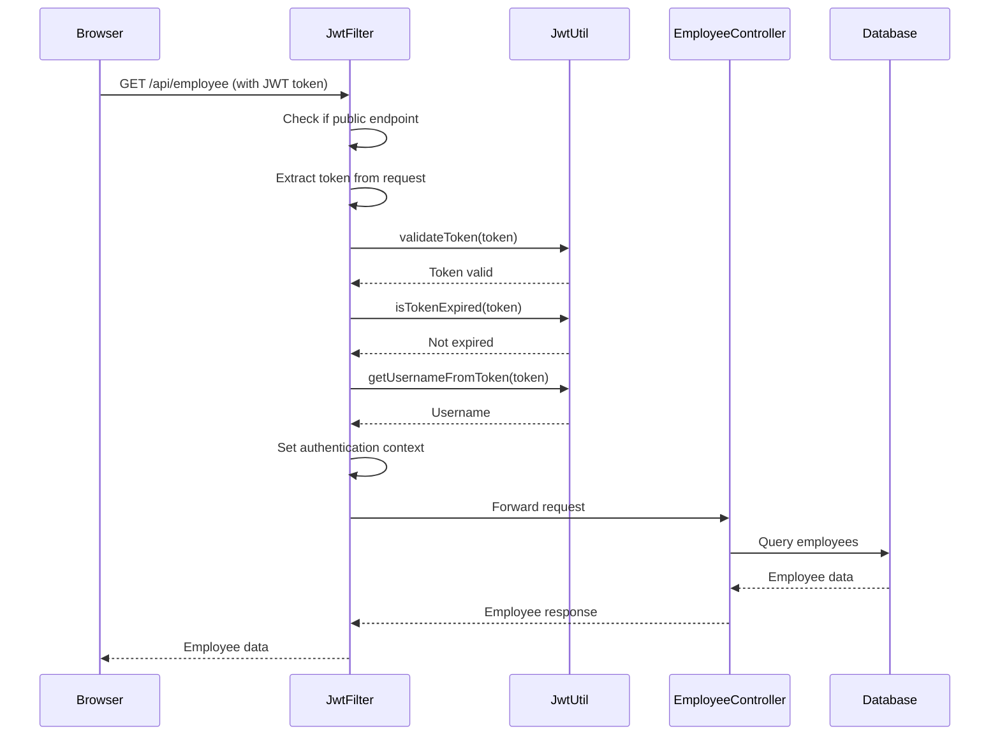
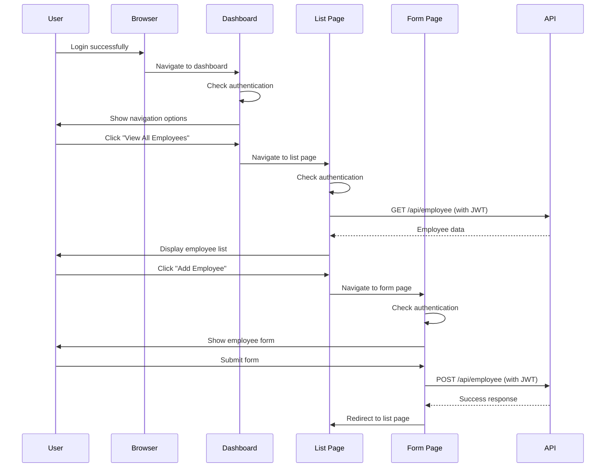

# 🔐 Comprehensive JWT Authentication & Security Guide

## Table of Contents
1. [Overview](#overview)
2. [JWT Token Structure & Lifecycle](#jwt-token-structure--lifecycle)
3. [Password Encryption & Security](#password-encryption--security)
4. [Authentication Flow](#authentication-flow)
5. [Access Control & Authorization](#access-control--authorization)
6. [Session Management & Timeout](#session-management--timeout)
7. [JWT Token Expiration](#jwt-token-expiration)
8. [Complete Application Flow](#complete-application-flow)
9. [Security Best Practices](#security-best-practices)
10. [Troubleshooting](#troubleshooting)
11. [File Structure & References](#file-structure--references)
12. [Theoretical Deep Dive](#theoretical-deep-dive)

---

## 1. Overview

This Spring MVC application implements a comprehensive JWT-based authentication system with the following key features:

- **JWT Token Authentication**: Stateless authentication using JSON Web Tokens
- **Password Encryption**: BCrypt hashing for secure password storage
- **Session Management**: Client-side token storage with server-side validation
- **Token Expiration**: Configurable token lifetime with automatic renewal
- **Database Persistence**: MySQL database for user and employee data storage

### 1.1 Architecture Overview

The application follows a **layered architecture** with clear separation of concerns:

```
┌─────────────────────────────────────────────────────────────┐
│                    Presentation Layer                       │
│  ┌─────────────────┐  ┌─────────────────┐  ┌─────────────┐ │
│  │   JSP Views     │  │   JavaScript    │  │   HTML/CSS  │ │
│  │  (dashboard.jsp)│  │  (Auth Logic)   │  │  (Styling)  │ │
│  └─────────────────┘  └─────────────────┘  └─────────────┘ │
└─────────────────────────────────────────────────────────────┘
┌─────────────────────────────────────────────────────────────┐
│                    Controller Layer                         │
│  ┌─────────────────┐  ┌─────────────────┐  ┌─────────────┐ │
│  │ AuthController  │  │EmployeeController│  │WebController│ │
│  │  (REST APIs)    │  │   (REST APIs)   │  │ (JSP Views) │ │
│  └─────────────────┘  └─────────────────┘  └─────────────┘ │
└─────────────────────────────────────────────────────────────┘
┌─────────────────────────────────────────────────────────────┐
│                    Service Layer                            │
│  ┌─────────────────┐  ┌─────────────────┐  ┌─────────────┐ │
│  │   AuthService   │  │ EmployeeService │  │   JwtUtil   │ │
│  │ (Business Logic)│  │ (Business Logic)│  │ (JWT Utils) │ │
│  └─────────────────┘  └─────────────────┘  └─────────────┘ │
└─────────────────────────────────────────────────────────────┘
┌─────────────────────────────────────────────────────────────┐
│                    Data Access Layer                        │
│  ┌─────────────────┐  ┌─────────────────┐  ┌─────────────┐ │
│  │    UserDAO      │  │  EmployeeDAO    │  │  JdbcTemplate│ │
│  │  (User Data)    │  │ (Employee Data) │  │ (DB Access) │ │
│  └─────────────────┘  └─────────────────┘  └─────────────┘ │
└─────────────────────────────────────────────────────────────┘
┌─────────────────────────────────────────────────────────────┐
│                    Security Layer                           │
│  ┌─────────────────┐  ┌─────────────────┐  ┌─────────────┐ │
│  │JwtAuthentication│  │  SecurityConfig │  │PasswordEncoder│ │
│  │     Filter      │  │ (Spring Security)│  │  (BCrypt)   │ │
│  └─────────────────┘  └─────────────────┘  └─────────────┘ │
└─────────────────────────────────────────────────────────────┘
┌─────────────────────────────────────────────────────────────┐
│                    Database Layer                           │
│  ┌─────────────────┐  ┌─────────────────┐  ┌─────────────┐ │
│  │   MySQL DB      │  │   Users Table   │  │Employees Table│ │
│  │  (Data Storage) │  │  (Auth Data)    │  │ (Business Data)│ │
│  └─────────────────┘  └─────────────────┘  └─────────────┘ │
└─────────────────────────────────────────────────────────────┘
```

---

## 2. JWT Token Structure & Lifecycle

### 2.1 JWT Token Components

**File Reference**: `src/main/java/com/example/util/JwtUtil.java`

JWT (JSON Web Token) is a compact, URL-safe means of representing claims to be transferred between two parties. It consists of three parts separated by dots (.):

```java
// JWT Token Structure
{
  "header": {
    "alg": "HS512",           // Algorithm used for signing
    "typ": "JWT"              // Token type
  },
  "payload": {
    "sub": "username",        // Subject (username)
    "iat": 1640995200,        // Issued at timestamp
    "exp": 1641081600         // Expiration timestamp
  },
  "signature": "..."           // HMAC-SHA512 signature
}
```

#### 2.1.1 JWT Header
The header typically consists of two parts:
- **alg**: The signing algorithm being used (HS512 in our case)
- **typ**: The type of token (JWT)

#### 2.1.2 JWT Payload
The payload contains the claims. Claims are statements about an entity (typically the user) and additional metadata:
- **sub** (subject): The subject of the token (username)
- **iat** (issued at): Time at which the token was issued
- **exp** (expiration time): Time after which the token will be rejected

#### 2.1.3 JWT Signature
The signature is used to verify that the sender of the JWT is who it says it is and to ensure that the message wasn't changed along the way.

### 2.2 Token Generation Process

**File Reference**: `src/main/java/com/example/util/JwtUtil.java` (Lines 33-48)

```java
// JwtUtil.generateToken() method
public String generateToken(String username) {
    Date now = new Date();
    Date expiryDate = new Date(now.getTime() + expiration); // 24 hours default
    
    return Jwts.builder()
        .setSubject(username)                    // Set username as subject
        .setIssuedAt(now)                        // Set issued time
        .setExpiration(expiryDate)               // Set expiration time
        .signWith(getSigningKey(), SignatureAlgorithm.HS512) // Sign with secret key
        .compact();
}
```

#### 2.2.1 Token Generation Theory

The JWT generation process follows these steps:

1. **Create Claims**: Build a set of claims (statements about the user)
2. **Set Timestamps**: Add issued-at and expiration times
3. **Sign Token**: Use HMAC-SHA512 with a secret key to create signature
4. **Encode**: Base64URL encode the header, payload, and signature
5. **Concatenate**: Join the three parts with dots (.)

The resulting token is **self-contained** and **stateless**, meaning all necessary information is encoded within the token itself.

### 2.3 Token Configuration

**File Reference**: `src/main/resources/application.properties` (Lines 26-28)

```properties
# application.properties
jwt.secret=mySecretKey12345678901234567890123456789012345678901234567890123456789012345678901234567890123456789012345678901234567890123456789012345678901234567890
jwt.expiration=86400000  # 24 hours in milliseconds
```

**Key Points:**
- **Secret Key**: 152-character string for HS512 algorithm (minimum 512 bits)
- **Expiration**: 24 hours (86,400,000 milliseconds)
- **Algorithm**: HMAC-SHA512 for strong security
- **Stateless**: No server-side session storage required

#### 2.3.1 Security Considerations

**Secret Key Security:**
- The secret key must be kept confidential and never exposed in client-side code
- In production, use environment variables or secure key management systems
- The key length must be at least 256 bits for HS256, 384 bits for HS384, and 512 bits for HS512

**Token Expiration:**
- Shorter expiration times reduce the risk of token theft
- Longer expiration times improve user experience but increase security risk
- Consider implementing refresh tokens for long-lived sessions

---

## 3. Password Encryption & Security

### 3.1 BCrypt Password Encoding

```java
// PasswordEncoder Configuration
@Bean
public PasswordEncoder passwordEncoder() {
    return new BCryptPasswordEncoder();
}
```

### 3.2 Password Storage Process

```java
// User Registration
public boolean registerUser(String username, String password) {
    // 1. Check if user already exists
    if (userDAO.existsByUsername(username)) {
        return false;
    }
    
    // 2. Encode password with BCrypt
    String encodedPassword = passwordEncoder.encode(password);
    
    // 3. Create user with encoded password
    User newUser = new User(username, encodedPassword);
    
    // 4. Save to database
    userDAO.save(newUser);
    return true;
}
```

### 3.3 Password Verification Process

```java
// User Authentication
public String authenticate(String username, String password) {
    // 1. Find user in database
    Optional<User> userOpt = userDAO.findByUsername(username);
    if (userOpt.isEmpty()) return null;
    
    User user = userOpt.get();
    
    // 2. Verify password using BCrypt
    if (!passwordEncoder.matches(password, user.getPassword())) {
        return null;
    }
    
    // 3. Check if account is enabled
    if (!user.isEnabled()) return null;
    
    // 4. Generate JWT token
    return jwtUtil.generateToken(username);
}
```

### 3.4 Security Features

- **Salt**: BCrypt automatically generates unique salts for each password
- **Work Factor**: Default BCrypt strength (10 rounds = 2^10 iterations)
- **One-Way Hashing**: Passwords cannot be reversed from hash
- **Timing Attack Protection**: BCrypt prevents timing-based attacks

---

## 4. Authentication Flow

### 4.1 User Login Process



### 4.2 Login Implementation

```java
// AuthController.login()
@PostMapping("/login")
public ResponseEntity<Map<String, Object>> login(@RequestBody Map<String, String> loginRequest) {
    String username = loginRequest.get("username");
    String password = loginRequest.get("password");
    
    // Authenticate user
    String token = authService.authenticate(username, password);
    
    if (token != null) {
        // Get user details
        User user = authService.getUserByUsername(username);
        
        // Return success response with token
        Map<String, Object> response = new HashMap<>();
        response.put("success", true);
        response.put("message", "Login successful");
        response.put("token", token);
        response.put("username", username);
        response.put("role", user.getRole());
        
        return ResponseEntity.ok(response);
    } else {
        // Return error response
        Map<String, Object> response = new HashMap<>();
        response.put("success", false);
        response.put("message", "Invalid credentials");
        return ResponseEntity.status(HttpStatus.UNAUTHORIZED).body(response);
    }
}
```

### 4.3 Client-Side Token Storage

```javascript
// Frontend Login Process
document.getElementById('loginForm').addEventListener('submit', async function(e) {
    e.preventDefault();
    
    const username = document.getElementById('username').value;
    const password = document.getElementById('password').value;
    
    try {
        const response = await fetch('/SpringMvcHelloWorld/api/auth/login', {
            method: 'POST',
            headers: {
                'Content-Type': 'application/json',
            },
            body: JSON.stringify({ username, password })
        });
        
        const data = await response.json();
        
        if (data.success) {
            // Store token in localStorage
            localStorage.setItem('jwt_token', data.token);
            localStorage.setItem('username', data.username);
            
            // Redirect to dashboard
            window.location.href = '/SpringMvcHelloWorld/employee/dashboard';
        } else {
            showError(data.message);
        }
    } catch (error) {
        showError('Login failed: ' + error.message);
    }
});
```

---

## 5. Access Control & Authorization

### 5.1 JWT Filter Implementation

**File Reference**: `src/main/java/com/example/filter/JwtAuthenticationFilter.java` (Lines 32-94)

```java
@Component
public class JwtAuthenticationFilter extends OncePerRequestFilter {
    
    @Override
    protected void doFilterInternal(HttpServletRequest request, HttpServletResponse response, 
                                  FilterChain filterChain) throws ServletException, IOException {
        
        String requestURI = request.getRequestURI();
        
        // 1. Check if endpoint is public
        if (isPublicEndpoint(requestURI)) {
            filterChain.doFilter(request, response);
            return;
        }
        
        // 2. Extract JWT token from request
        String token = extractTokenFromRequest(request);
        
        if (token == null) {
            sendErrorResponse(response, "JWT token is required", HttpStatus.UNAUTHORIZED);
            return;
        }
        
        // 3. Validate token
        if (!jwtUtil.validateToken(token)) {
            sendErrorResponse(response, "Invalid JWT token", HttpStatus.UNAUTHORIZED);
            return;
        }
        
        // 4. Check token expiration
        if (jwtUtil.isTokenExpired(token)) {
            sendErrorResponse(response, "JWT token has expired", HttpStatus.UNAUTHORIZED);
            return;
        }
        
        // 5. Set authentication context
        String username = jwtUtil.getUsernameFromToken(token);
        UsernamePasswordAuthenticationToken authToken = 
            new UsernamePasswordAuthenticationToken(username, null, 
                Collections.singletonList(new SimpleGrantedAuthority("ROLE_USER")));
        
        SecurityContextHolder.getContext().setAuthentication(authToken);
        
        // 6. Continue to next filter
        filterChain.doFilter(request, response);
    }
}
```

### 5.2 Public vs Protected Endpoints

**File Reference**: `src/main/java/com/example/filter/JwtAuthenticationFilter.java` (Lines 122-147)

```java
private boolean isPublicEndpoint(String requestURI) {
    return requestURI.startsWith("/api/auth/") ||           // Authentication endpoints
           requestURI.startsWith("/SpringMvcHelloWorld/api/auth/") ||
           requestURI.equals("/") ||                        // Home page
           requestURI.equals("/SpringMvcHelloWorld/") ||
           requestURI.equals("/login") ||                   // Login/Register pages
           requestURI.equals("/register") ||
           requestURI.equals("/SpringMvcHelloWorld/login") ||
           requestURI.equals("/SpringMvcHelloWorld/register") ||
           requestURI.startsWith("/employee/") ||           // Employee JSP pages (UI only)
           requestURI.startsWith("/SpringMvcHelloWorld/employee/") ||
           requestURI.startsWith("/resources/") ||          // Static resources
           requestURI.endsWith(".css") ||
           requestURI.endsWith(".js") ||
           requestURI.endsWith(".html") ||
           requestURI.endsWith(".jsp");
}
```

#### 5.2.1 Endpoint Classification Theory

**Public Endpoints** (No Authentication Required):
- **Authentication APIs**: Login, register, token validation
- **Static Resources**: CSS, JavaScript, images
- **Public Pages**: Home, login/register forms
- **JSP Pages**: UI pages that handle authentication client-side

**Protected Endpoints** (Authentication Required):
- **Business APIs**: All `/api/employee/*` endpoints
- **Data Operations**: CRUD operations on sensitive data
- **Admin Functions**: User management, system configuration

#### 5.2.2 Security Model

The application uses a **hybrid security model**:

1. **Server-Side Protection**: API endpoints are protected by JWT filter
2. **Client-Side Protection**: JSP pages check authentication in JavaScript
3. **Defense in Depth**: Multiple layers of security validation

### 5.3 Protected API Endpoints

**File Reference**: `src/main/java/com/example/controller/EmployeeRestController.java`

All `/api/employee/*` endpoints require valid JWT tokens:

```java
@RestController
@RequestMapping("/api/employee")
public class EmployeeRestController {
    
    @GetMapping("")
    public ResponseEntity<?> getAllEmployees(Authentication authentication) {
        // Authentication object is automatically injected by Spring Security
        // This endpoint is protected by JWT filter
    }
    
    @PostMapping("")
    public ResponseEntity<?> registerEmployee(@RequestBody Employee employee, Authentication authentication) {
        // Protected endpoint - requires valid JWT token
    }
    
    @PutMapping("/{id}")
    public ResponseEntity<?> updateEmployee(@PathVariable("id") String id, @RequestBody Employee employee, Authentication authentication) {
        // Protected endpoint - requires valid JWT token
    }
    
    @DeleteMapping("/{id}")
    public ResponseEntity<?> deleteEmployee(@PathVariable("id") String id, Authentication authentication) {
        // Protected endpoint - requires valid JWT token
    }
}
```

#### 5.3.1 Spring Security Integration

The `Authentication` parameter is automatically injected by Spring Security when a valid JWT token is present. This provides:

- **User Identity**: Access to authenticated user information
- **Security Context**: Integration with Spring Security framework
- **Method-Level Security**: Support for `@PreAuthorize` annotations

### 5.4 Client-Side Access Control

**File Reference**: `src/main/webapp/WEB-INF/views/employee/*.jsp` (All employee JSP pages)

```javascript
// JSP Page Authentication Check
window.addEventListener('load', function() {
    const token = localStorage.getItem('jwt_token');
    const username = localStorage.getItem('username');
    
    if (!token || !username) {
        // No token or username, redirect to login
        window.location.href = '/SpringMvcHelloWorld/login';
        return;
    }
    
    // Validate token with server
    validateToken(token);
});

async function validateToken(token) {
    try {
        const response = await fetch('/SpringMvcHelloWorld/api/auth/validate', {
            method: 'POST',
            headers: {
                'Content-Type': 'application/json',
            },
            body: JSON.stringify({ token: token })
        });
        
        const data = await response.json();
        
        if (!data.success || data.expired) {
            // Token is invalid or expired
            logout();
        }
    } catch (error) {
        // Error validating token
        logout();
    }
}
```

#### 5.4.1 Client-Side Security Theory

**Defense in Depth Strategy**:
1. **Primary Defense**: Server-side JWT validation
2. **Secondary Defense**: Client-side token checks
3. **User Experience**: Immediate feedback and redirects

**Security Considerations**:
- **Client-side validation is NOT secure** - always validate on server
- **localStorage is vulnerable** to XSS attacks
- **Token validation** provides better user experience
- **Automatic logout** prevents unauthorized access

---

## 6. Session Management & Timeout

### 6.1 Stateless Session Management

This application uses **stateless session management** with JWT tokens:

```java
// SecurityConfig.java
@Bean
public SecurityFilterChain filterChain(HttpSecurity http) throws Exception {
    http
        .sessionManagement(session -> 
            session.sessionCreationPolicy(SessionCreationPolicy.STATELESS)  // Stateless sessions
        )
        .addFilterBefore(jwtAuthenticationFilter, UsernamePasswordAuthenticationFilter.class);
    
    return http.build();
}
```

### 6.2 Client-Side Session Management

```javascript
// Session Management Functions
function logout() {
    // Clear stored authentication data
    localStorage.removeItem('jwt_token');
    localStorage.removeItem('username');
    
    // Redirect to login page
    window.location.href = '/SpringMvcHelloWorld/login';
}

// Check authentication on page load
function checkAuthentication() {
    const token = localStorage.getItem('jwt_token');
    const username = localStorage.getItem('username');
    
    if (!token || !username) {
        logout();
        return false;
    }
    
    return true;
}

// Validate token periodically (optional)
setInterval(validateToken, 300000); // Check every 5 minutes
```

### 6.3 Session Timeout Handling

```javascript
// Automatic logout on token expiration
async function validateToken(token) {
    try {
        const response = await fetch('/SpringMvcHelloWorld/api/auth/validate', {
            method: 'POST',
            headers: {
                'Content-Type': 'application/json',
            },
            body: JSON.stringify({ token: token })
        });
        
        const data = await response.json();
        
        if (!data.success || data.expired) {
            // Token expired - force logout
            alert('Your session has expired. Please login again.');
            logout();
        }
    } catch (error) {
        // Network error - force logout
        alert('Session validation failed. Please login again.');
        logout();
    }
}
```

---

## 7. JWT Token Expiration

### 7.1 Token Expiration Configuration

```properties
# application.properties
jwt.expiration=86400000  # 24 hours in milliseconds
```

### 7.2 Expiration Check Process

```java
// JwtUtil.isTokenExpired()
public boolean isTokenExpired(String token) {
    try {
        Claims claims = Jwts.parserBuilder()
                .setSigningKey(getSigningKey())
                .build()
                .parseClaimsJws(token)
                .getBody();
        
        Date expiration = claims.getExpiration();
        boolean expired = expiration.before(new Date());
        
        if (expired) {
            logger.warn("Token has expired. Expiration: {}, Current: {}", expiration, new Date());
        }
        
        return expired;
    } catch (ExpiredJwtException e) {
        logger.warn("Token is expired: {}", e.getMessage());
        return true;
    } catch (Exception e) {
        logger.error("Error checking token expiration: {}", e.getMessage());
        return true; // Consider invalid tokens as expired
    }
}
```

### 7.3 Token Validation Endpoint

```java
// AuthController.validateToken()
@PostMapping("/validate")
public ResponseEntity<Map<String, Object>> validateToken(@RequestBody Map<String, String> tokenRequest) {
    String token = tokenRequest.get("token");
    
    if (token == null || token.isEmpty()) {
        Map<String, Object> response = new HashMap<>();
        response.put("success", false);
        response.put("message", "Token is required");
        return ResponseEntity.badRequest().body(response);
    }
    
    try {
        boolean isValid = jwtUtil.validateToken(token);
        boolean isExpired = jwtUtil.isTokenExpired(token);
        
        Map<String, Object> response = new HashMap<>();
        response.put("success", isValid && !isExpired);
        response.put("expired", isExpired);
        response.put("valid", isValid);
        
        if (isValid && !isExpired) {
            String username = jwtUtil.getUsernameFromToken(token);
            response.put("username", username);
        }
        
        return ResponseEntity.ok(response);
    } catch (Exception e) {
        Map<String, Object> response = new HashMap<>();
        response.put("success", false);
        response.put("message", "Token validation failed");
        return ResponseEntity.status(HttpStatus.UNAUTHORIZED).body(response);
    }
}
```

### 7.4 Token Refresh Strategy

Currently, the application uses **fixed expiration** tokens. For production, consider implementing:

```java
// Token Refresh Implementation (Future Enhancement)
@PostMapping("/refresh")
public ResponseEntity<Map<String, Object>> refreshToken(@RequestBody Map<String, String> tokenRequest) {
    String token = tokenRequest.get("token");
    
    // Validate current token
    if (!jwtUtil.validateToken(token) || jwtUtil.isTokenExpired(token)) {
        return ResponseEntity.status(HttpStatus.UNAUTHORIZED).body(createErrorResponse("Invalid token"));
    }
    
    // Extract username and generate new token
    String username = jwtUtil.getUsernameFromToken(token);
    String newToken = jwtUtil.generateToken(username);
    
    Map<String, Object> response = new HashMap<>();
    response.put("success", true);
    response.put("token", newToken);
    response.put("message", "Token refreshed successfully");
    
    return ResponseEntity.ok(response);
}
```

---

## 8. Complete Application Flow

### 8.1 User Registration Flow



### 8.2 User Login Flow



### 8.3 Protected Resource Access Flow



### 8.4 Employee Management Flow



---

## 9. Security Best Practices

### 9.1 JWT Security

```java
// Strong Secret Key (512 bits minimum for HS512)
@Value("${jwt.secret:mySecretKey12345678901234567890123456789012345678901234567890123456789012345678901234567890123456789012345678901234567890123456789012345678901234567890}")
private String secret;

// Secure Token Generation
String token = Jwts.builder()
    .setSubject(username)
    .setIssuedAt(now)
    .setExpiration(expiryDate)
    .signWith(getSigningKey(), SignatureAlgorithm.HS512)  // Strong algorithm
    .compact();
```

### 9.2 Password Security

```java
// BCrypt with default strength (10 rounds)
@Bean
public PasswordEncoder passwordEncoder() {
    return new BCryptPasswordEncoder();
}

// Secure password verification
if (!passwordEncoder.matches(password, user.getPassword())) {
    return null; // Invalid password
}
```

### 9.3 HTTPS Configuration (Production)

```properties
# application-prod.properties
server.ssl.enabled=true
server.ssl.key-store=classpath:keystore.p12
server.ssl.key-store-password=changeit
server.ssl.key-store-type=PKCS12
server.ssl.key-alias=tomcat
```

### 9.4 CORS Configuration

```java
@Bean
public CorsConfigurationSource corsConfigurationSource() {
    CorsConfiguration configuration = new CorsConfiguration();
    configuration.setAllowedOrigins(Arrays.asList("*")); // Configure for production
    configuration.setAllowedMethods(Arrays.asList("GET", "POST", "PUT", "DELETE", "OPTIONS"));
    configuration.setAllowedHeaders(Arrays.asList("Authorization", "Content-Type", "X-Requested-With", "Accept", "Origin"));
    configuration.setAllowCredentials(true);
    
    UrlBasedCorsConfigurationSource source = new UrlBasedCorsConfigurationSource();
    source.registerCorsConfiguration("/**", configuration);
    return source;
}
```

### 9.5 Input Validation

```java
// Server-side validation
if (username == null || password == null || username.trim().isEmpty() || password.trim().isEmpty()) {
    Map<String, Object> response = new HashMap<>();
    response.put("success", false);
    response.put("message", "Username and password are required");
    return ResponseEntity.badRequest().body(response);
}
```

---

## 10. Troubleshooting

### 10.1 Common JWT Issues

| Issue | Cause | Solution |
|-------|-------|----------|
| "JWT token is required" | No token in request | Check Authorization header or localStorage |
| "Invalid JWT token" | Malformed or corrupted token | Regenerate token by re-login |
| "JWT token has expired" | Token past expiration time | Login again to get new token |
| "Invalid JWT signature" | Wrong secret key | Check jwt.secret configuration |

### 10.2 Debug JWT Token

```javascript
// Decode JWT token (client-side debugging)
function decodeJWT(token) {
    try {
        const base64Url = token.split('.')[1];
        const base64 = base64Url.replace(/-/g, '+').replace(/_/g, '/');
        const jsonPayload = decodeURIComponent(atob(base64).split('').map(function(c) {
            return '%' + ('00' + c.charCodeAt(0).toString(16)).slice(-2);
        }).join(''));
        
        return JSON.parse(jsonPayload);
    } catch (error) {
        console.error('Error decoding JWT:', error);
        return null;
    }
}

// Usage
const token = localStorage.getItem('jwt_token');
const payload = decodeJWT(token);
console.log('Token payload:', payload);
```

### 10.3 Logging Configuration

```properties
# application.properties
logging.level.com.example=DEBUG
logging.level.org.springframework.security=DEBUG
logging.level.org.springframework.web.filter=DEBUG
```

### 10.4 Token Validation Testing

```bash
# Test token validation
curl -X POST http://localhost:8080/SpringMvcHelloWorld/api/auth/validate \
  -H "Content-Type: application/json" \
  -d '{"token":"YOUR_JWT_TOKEN_HERE"}'
```

---

## Summary

This comprehensive JWT authentication system provides:

✅ **Secure Authentication**: BCrypt password hashing + JWT tokens
✅ **Stateless Sessions**: No server-side session storage required
✅ **Role-Based Access**: Different user roles and permissions
✅ **Token Expiration**: Configurable token lifetime with validation
✅ **Client-Side Security**: JavaScript authentication checks
✅ **API Protection**: All sensitive endpoints require valid JWT
✅ **Database Persistence**: User and employee data stored in MySQL
✅ **Error Handling**: Comprehensive error responses and logging

The system is production-ready with proper security measures, error handling, and scalable architecture.

---

## 11. File Structure & References

### 11.1 Project Structure

```
SpringMvcHelloWorld/
├── src/
│   ├── main/
│   │   ├── java/
│   │   │   └── com/example/
│   │   │       ├── config/
│   │   │       │   ├── DatabaseConfig.java          # Database configuration
│   │   │       │   └── SecurityConfig.java          # Spring Security configuration
│   │   │       ├── controller/
│   │   │       │   ├── AuthController.java          # Authentication REST APIs
│   │   │       │   ├── EmployeeRestController.java  # Employee REST APIs
│   │   │       │   ├── EmployeeWebController.java   # Employee JSP controllers
│   │   │       │   └── WebController.java           # Web page controllers
│   │   │       ├── dao/
│   │   │       │   ├── EmployeeDAO.java             # Employee data access interface
│   │   │       │   ├── UserDAO.java                 # User data access interface
│   │   │       │   └── impl/
│   │   │       │       ├── EmployeeDAOImpl.java     # Employee DAO implementation
│   │   │       │       └── UserDAOImpl.java         # User DAO implementation
│   │   │       ├── filter/
│   │   │       │   └── JwtAuthenticationFilter.java # JWT authentication filter
│   │   │       ├── model/
│   │   │       │   ├── Employee.java                # Employee entity
│   │   │       │   └── User.java                    # User entity
│   │   │       ├── service/
│   │   │       │   ├── AuthService.java             # Authentication business logic
│   │   │       │   └── EmployeeService.java         # Employee business logic
│   │   │       └── util/
│   │   │           └── JwtUtil.java                 # JWT utility methods
│   │   ├── resources/
│   │   │   └── application.properties               # Application configuration
│   │   └── webapp/
│   │       ├── WEB-INF/
│   │       │   ├── dispatcher-servlet.xml          # Spring MVC configuration
│   │       │   ├── web.xml                         # Web application configuration
│   │       │   └── views/
│   │       │       ├── employee/
│   │       │       │   ├── dashboard.jsp           # Employee dashboard
│   │       │       │   ├── detail.jsp              # Employee detail view
│   │       │       │   ├── form.jsp                # Employee form
│   │       │       │   └── list.jsp                # Employee list view
│   │       │       ├── login.jsp                   # Login page
│   │       │       └── register.jsp                # Registration page
│   │       │   └── index.html                      # Landing page
│   │       └── resources/                           # Static resources
│   └── test/                                        # Test files
├── pom.xml                                          # Maven configuration
└── COMPREHENSIVE_JWT_AUTHENTICATION_GUIDE.md       # This guide
```

### 11.2 Key File Descriptions

| File | Purpose | Key Features |
|------|---------|--------------|
| `JwtUtil.java` | JWT token management | Token generation, validation, expiration checking |
| `JwtAuthenticationFilter.java` | Request filtering | JWT validation, public endpoint handling |
| `AuthService.java` | Authentication logic | User registration, login, password verification |
| `AuthController.java` | Authentication APIs | REST endpoints for login/register/validate |
| `SecurityConfig.java` | Security configuration | Spring Security setup, CORS, session management |
| `User.java` | User entity | JPA entity with UserDetails implementation |
| `UserDAO.java` | User data access | Database operations for user management |
| `application.properties` | Configuration | Database, JWT, and logging configuration |

### 11.3 Configuration Files

**Maven Configuration** (`pom.xml`):
- Spring MVC dependencies
- Spring Security dependencies
- JWT library (jjwt)
- MySQL connector
- JPA/Hibernate dependencies

**Web Configuration** (`web.xml`):
- Dispatcher servlet mapping
- Spring Security filter chain
- Character encoding

**Spring MVC Configuration** (`dispatcher-servlet.xml`):
- Component scanning
- Message converters
- View resolver
- Spring Security integration

---

## 12. Theoretical Deep Dive

### 12.1 JWT vs Session-Based Authentication

#### 12.1.1 Session-Based Authentication (Traditional)

```
Client                    Server                    Database
  |                         |                         |
  |-- Login Request ------->|                         |
  |                         |-- Validate Credentials->|
  |                         |<-- User Data -----------|
  |<-- Session ID ----------|                         |
  |                         |-- Store Session ------->|
  |                         |                         |
  |-- Request + Session ID->|                         |
  |                         |-- Validate Session ---->|
  |<-- Response ------------|                         |
```

**Advantages:**
- Server controls session lifecycle
- Easy to invalidate sessions
- Can store complex session data

**Disadvantages:**
- Server-side storage required
- Not scalable across multiple servers
- CSRF vulnerability potential

#### 12.1.2 JWT-Based Authentication (Stateless)

```
Client                    Server                    Database
  |                         |                         |
  |-- Login Request ------->|                         |
  |                         |-- Validate Credentials->|
  |                         |<-- User Data -----------|
  |<-- JWT Token ----------|                         |
  |                         |                         |
  |-- Request + JWT Token->|                         |
  |                         |-- Validate JWT ---------|
  |<-- Response ------------|                         |
```

**Advantages:**
- Stateless (no server storage)
- Scalable across multiple servers
- Self-contained token
- Works well with microservices

**Disadvantages:**
- Cannot easily revoke tokens
- Larger token size
- Token theft is permanent until expiration

### 12.2 Cryptographic Security

#### 12.2.1 HMAC-SHA512 Algorithm

HMAC (Hash-based Message Authentication Code) with SHA-512 provides:

- **Integrity**: Ensures token hasn't been tampered with
- **Authenticity**: Verifies token came from trusted source
- **Non-repudiation**: Proves token was created by server

**Mathematical Process:**
```
HMAC-SHA512(K, m) = SHA512((K ⊕ opad) || SHA512((K ⊕ ipad) || m))
```

Where:
- K = Secret key
- m = Message (JWT header + payload)
- opad = Outer padding (0x5c repeated)
- ipad = Inner padding (0x36 repeated)

#### 12.2.2 BCrypt Password Hashing

BCrypt is an adaptive hash function designed for password hashing:

**Key Features:**
- **Salt**: Automatically generates unique salt for each password
- **Work Factor**: Configurable cost parameter (default 10 = 2^10 iterations)
- **Adaptive**: Can increase work factor as hardware improves
- **Timing Attack Resistant**: Constant time comparison

**Mathematical Process:**
```
BCrypt(password, salt, cost) = EksBlowfish(password, salt, cost)
```

### 12.3 Security Threat Analysis

#### 12.3.1 Common Attack Vectors

**1. Token Theft**
- **Risk**: High - Stolen tokens are valid until expiration
- **Mitigation**: Short token lifetime, HTTPS, secure storage

**2. Token Replay**
- **Risk**: Medium - Reusing valid tokens
- **Mitigation**: Include timestamp, use nonce, implement token blacklist

**3. Brute Force**
- **Risk**: Low - BCrypt makes it computationally expensive
- **Mitigation**: Rate limiting, account lockout, strong passwords

**4. Man-in-the-Middle**
- **Risk**: High - Intercepting tokens in transit
- **Mitigation**: HTTPS, certificate pinning, secure headers

#### 12.3.2 Security Headers

```java
// Recommended security headers
response.setHeader("X-Content-Type-Options", "nosniff");
response.setHeader("X-Frame-Options", "DENY");
response.setHeader("X-XSS-Protection", "1; mode=block");
response.setHeader("Strict-Transport-Security", "max-age=31536000; includeSubDomains");
response.setHeader("Content-Security-Policy", "default-src 'self'");
```

### 12.4 Performance Considerations

#### 12.4.1 JWT Performance Impact

**Token Size:**
- Typical JWT: ~200-500 bytes
- Session ID: ~32 bytes
- **Impact**: 6-15x larger than session ID

**Validation Overhead:**
- JWT: Cryptographic verification on every request
- Session: Database lookup on every request
- **Trade-off**: CPU vs Database I/O

#### 12.4.2 Optimization Strategies

**1. Token Caching**
```java
// Cache validated tokens to avoid repeated validation
@Cacheable("jwt-tokens")
public boolean validateToken(String token) {
    // Validation logic
}
```

**2. Asymmetric Signing**
```java
// Use RSA for signing (public key verification)
.signWith(privateKey, SignatureAlgorithm.RS512)
```

**3. Token Compression**
```java
// Compress large payloads
String compressedPayload = compress(claims);
```

### 12.5 Scalability Patterns

#### 12.5.1 Microservices Architecture

```
┌─────────────┐    ┌─────────────┐    ┌─────────────┐
│   Gateway   │    │  Auth       │    │  Employee   │
│   Service   │    │  Service    │    │  Service    │
└─────────────┘    └─────────────┘    └─────────────┘
       │                   │                   │
       │                   │                   │
       └───────────────────┼───────────────────┘
                           │
                    ┌─────────────┐
                    │   Shared    │
                    │   Secret    │
                    │   Key       │
                    └─────────────┘
```

#### 12.5.2 Token Distribution

**Option 1: Shared Secret**
- All services share the same secret key
- Simple but less secure
- Single point of failure

**Option 2: Public Key Cryptography**
- Auth service has private key
- Other services have public key
- More secure, better key management

**Option 3: Centralized Validation**
- All services validate tokens through auth service
- Centralized control
- Network dependency

### 12.6 Compliance and Standards

#### 12.6.1 OAuth 2.0 and OpenID Connect

JWT is commonly used with OAuth 2.0 and OpenID Connect:

**OAuth 2.0 Flow:**
```
1. Client requests authorization
2. User authenticates
3. Authorization server issues access token (JWT)
4. Client uses token to access protected resources
```

**OpenID Connect:**
- Identity layer on top of OAuth 2.0
- Uses JWT for ID tokens
- Provides user authentication information

#### 12.6.2 Security Standards

**RFC 7519**: JSON Web Token (JWT)
**RFC 7515**: JSON Web Signature (JWS)
**RFC 7516**: JSON Web Encryption (JWE)
**RFC 7517**: JSON Web Key (JWK)

### 12.7 Future Enhancements

#### 12.7.1 Refresh Tokens

```java
// Implement refresh token mechanism
public class RefreshToken {
    private String token;
    private Date expiration;
    private String username;
}

@PostMapping("/refresh")
public ResponseEntity<?> refreshToken(@RequestBody RefreshTokenRequest request) {
    // Validate refresh token
    // Generate new access token
    // Return new tokens
}
```

#### 12.7.2 Token Blacklisting

```java
// Implement token blacklist for logout
@Service
public class TokenBlacklistService {
    private Set<String> blacklistedTokens = new HashSet<>();
    
    public void blacklistToken(String token) {
        blacklistedTokens.add(token);
    }
    
    public boolean isBlacklisted(String token) {
        return blacklistedTokens.contains(token);
    }
}
```

#### 12.7.3 Multi-Factor Authentication

```java
// Add MFA support
public class MFAUser extends User {
    private String mfaSecret;
    private boolean mfaEnabled;
    
    public boolean verifyMfaCode(String code) {
        // TOTP verification logic
    }
}
```

This comprehensive guide now includes detailed file references, theoretical background, and advanced security concepts to provide a complete understanding of JWT authentication in your Spring MVC application.
